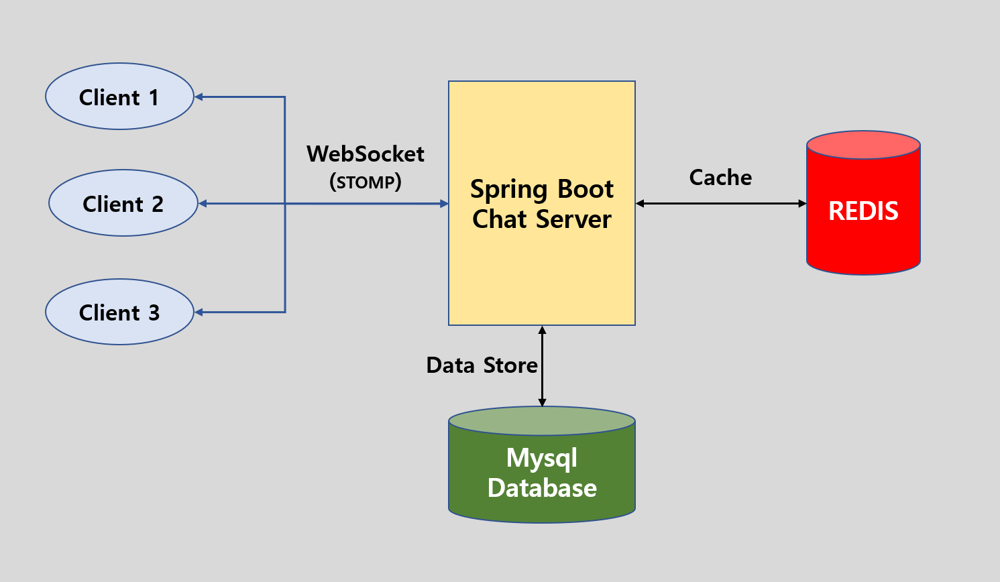

## Programmer Ground Chatting Server

### 1. Requirement
> Go 1.15.5 is required.

### 2. Server Architecutre



### 3. Server Build

#### 1. Go Command
```bash
    go build -race -o build/PGChatServer main.go client.go hub.go
```

#### 2. Make Command
```bash
    make build
```

### 4. Server Run
```bash
    ./build/PGChatServer
```

server running via http://localhost:8080